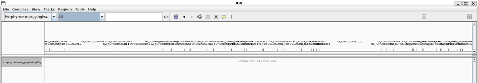
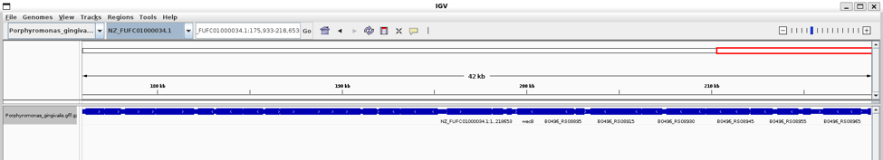
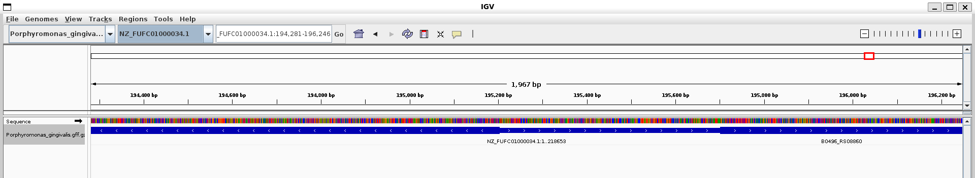
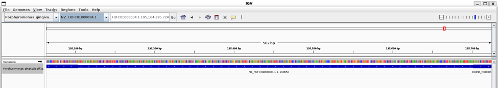
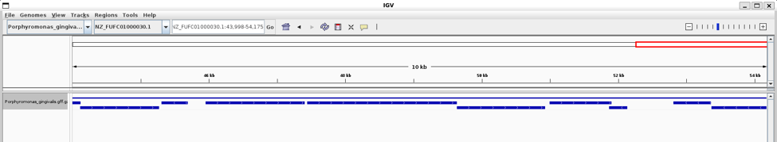
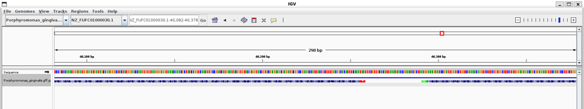
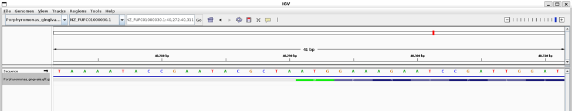
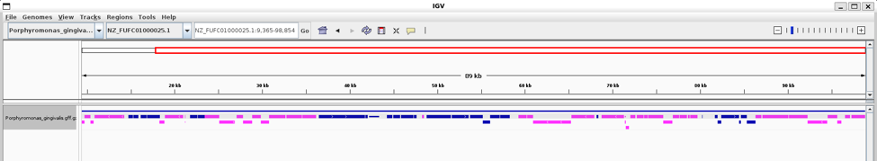

#Week 2: Visualize genomic data

###Making the Makefile:

I chose a _Porphyromonas gingivalis_ genome from NCBI. Using this Makefile involves three commands:

`make all` downloads the requested files and outputs genome size and number of annotations

`make igv` opens those files in IGV through the command line

`make clean` removes the created directories so the Makefile can be run again without errors


**First input to VSCode:**

I am doing bioinformatics at the command line. I need a Makefile that will:

1\. Download and unzip the FASTA file from: <https://ftp.ncbi.nlm.nih.gov/genomes/all/GCF/900/157/325/GCF_900157325.1_3A1/GCF_900157325.1_3A1_genomic.fna.gz> and put it at ./fasta/Porphyromonas_gingivalis.fna

2\. Download and unzip the GFF file from: <https://ftp.ncbi.nlm.nih.gov/genomes/all/GCF/900/157/325/GCF_900157325.1_3A1/GCF_900157325.1_3A1_genomic.gff.gz> and put it at ./gff/Porphyromonas_gingivalis.gff

3\. Print 2 things to the stdout: The size of the genome, and the number of annotations in the annotation file.

4\. Visualize the FASTA and GFF files in IGV. Both need to be indexed.


**Prompts used to make modifications:**

The makefile failed, reporting this:  
```
tbx_index_build3 failed: gff/Porphyromonas_gingivalis.gff.gz  
make: \*\*\* \[Makefile:43: gff/Porphyromonas_gingivalis.gff.gz.tbi\] Error 1
```

Is this makefile unzipping and then re-zipping the gff file? Why does the gff file need to be sorted and re-zipped?


###_Porphyromonas gingivalis_ genome characteristics:

Genome size: 2343280 bp

_Porphyromonas gingivalis_ has one chromosome.

Number of annotations: 4311


###Visualizing the genome in IGV:

Looking at IGV, this genome is quite complete. Most regions of the genomes have multiple contigs aligned. There do not seem to many large regions which have only one aligned contig.











The genes in this genome are packed fairly closely together. At this locus, the genes are approximately 40 bp apart.



This shows a methionine/start codon. In the forward direction, this could also be read as TGG (tryptophan) or GGA (glycine). In the reverse direction, this could be read as TAC (tyrosine), ACC (threonine), or CCT (proline).



The data track is a GFF file.

This view shows the negative strand in pink.

